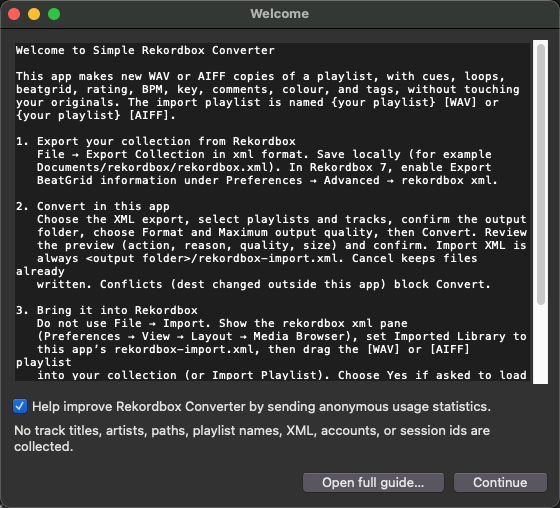
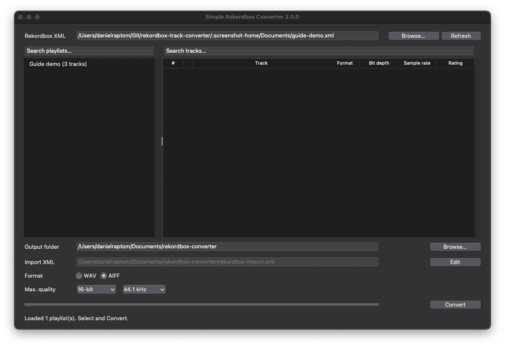
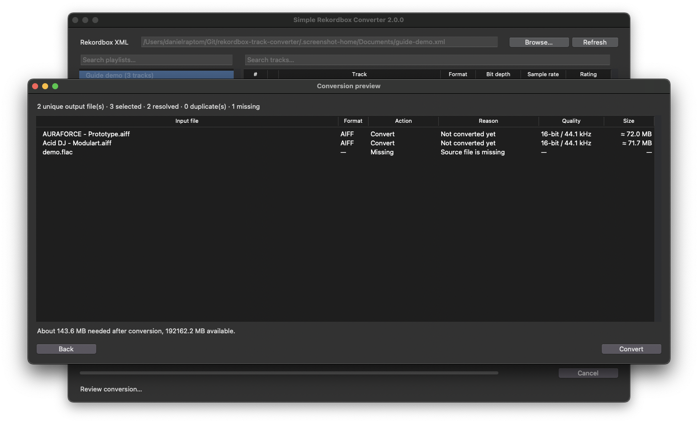

# Simple Rekordbox Converter

<p align="center">
  
</p>

[](LICENSE)
[](https://github.com/slnnzmtl/rekordbox-playlist-converter/actions/workflows/test.yml)

Turn a Rekordbox playlist of lossless tracks into **WAV** or **AIFF** files, **without changing your originals**. Cues, loops, beatgrid, rating, BPM, key, comments, colour, and tags are copied into a new playlist named `{your playlist} [WAV]` or `{your playlist} [AIFF]`.

Supports the Rekordbox **6** and **7** XML export → convert → **rekordbox xml** import **workflow**. Live import is **verified on macOS** with Rekordbox **6.8.5** and **7.2.18** (cues, grids, ratings, playlist order, repeated Keys, shared tracks, and playback from the converter Location). Other Rekordbox builds, Windows live import, and empty checklist cells are **untested**, not a claim of support. Evidence: [docs/rekordbox-xml-import-checklist.md](docs/rekordbox-xml-import-checklist.md).

**Not File → Import.** Rekordbox loads this XML from the **rekordbox xml** pane. The full click-path with screenshots is in **[USAGE.md](USAGE.md)** (macOS app **v2.0.0**).

This tree is **2.0.0**. Download the macOS app from [Releases](https://github.com/slnnzmtl/rekordbox-playlist-converter/releases/tag/v2.0.0), or [build this tree](#build-the-app). Use [USAGE.md](USAGE.md) with **2.0.0**, not an older **v1.x** download. The **CLI** runs on macOS, Linux, and Windows (Python 3.10+ and `ffmpeg`).

## What gets converted


| You have                               | Output                                                                |
| -------------------------------------- | --------------------------------------------------------------------- |
| FLAC / ALAC / AIFF / WAV               | Stereo PCM at selected max bit depth (16/24) and sample rate (44.1/48 kHz); never upconvert |
| Already matching dest                  | Skip when container + effective quality match (AIFF also ID3/art)     |


MP3, AAC, and other lossy files are skipped with an error.

Quality flags are a **ceiling**, not a target: 16-bit tracks stay 16-bit; 44.1 kHz tracks stay 44.1 kHz. Other sample rates (for example 88.2 kHz or 22.05 kHz) are snapped to 44100 when that rate is allowed by the ceiling. Defaults are WAV / 24-bit / 48 kHz.

**WAV profile:** uncompressed stereo `WAVE_FORMAT_PCM` (not extensible), `fmt `+`data` only, at the effective depth/rate.

**AIFF profile:** uncompressed `FORM`/`AIFF` (not AIFC), stereo PCM at the effective depth/rate, plus ID3v2.3 text from the Rekordbox XML and an optional JPEG cover from the source file.

## macOS app (no Terminal)

**Simple Rekordbox Converter.app** is a **universal** binary (Intel and Apple Silicon) for **2.0.0**. Download from [Releases](https://github.com/slnnzmtl/rekordbox-playlist-converter/releases/tag/v2.0.0), or [build this tree](#build-the-app) below.







1. **Download / Open.** Ad-hoc signed: if Gatekeeper blocks it, right-click → **Open**. Documents access is optional (fallback `~/rekordbox-converter`).
2. **Welcome & updates.** First-launch analytics checkbox is checked by default. Help → **Check for Updates…** may contact GitHub Releases (separate from analytics). See [SECURITY.md](SECURITY.md) and [Privacy](#privacy).
3. **Export & convert.** Export the Rekordbox collection XML, select playlists/tracks, choose WAV or AIFF and a quality ceiling, then **Convert** (preview shows action, reason, quality, size; conflicts block overwrite).
4. **Finish & import.** Cancel keeps written files; finish titles are Done / Partial / Failed / Cancelled. **Reveal output folder**, then in Rekordbox set **Imported Library** to `rekordbox-import.xml` and Import Playlist. **Edit** can safely remove playlists/tracks from a generated library.

Full steps, troubleshooting, and recovery: **[USAGE.md](USAGE.md)**. Compatibility evidence: [docs/rekordbox-xml-import-checklist.md](docs/rekordbox-xml-import-checklist.md).

On launch the app also searches your home folder (top-level files) and `~/Documents` for `*rekordbox*.xml` (skipping Desktop, Downloads, and iCloud) and auto-loads a single match, or asks you to choose if several are found.

### Build the .app

Needs the [python.org macOS 64-bit universal2](https://www.python.org/downloads/macos/) installer (3.12 or newer, Tk included). Homebrew Python cannot produce this `.app`.

```bash
./scripts/build-macos-app.sh
```

That script downloads static **release** `ffmpeg`/`ffprobe` for arm64 and amd64 from [ffmpeg.martin-riedl.de](https://ffmpeg.martin-riedl.de/), lipos them into `vendor/ffmpeg/`, copies the ffmpeg GPL notice from `third_party/ffmpeg/`, recreates `.venv` from the python.org interpreter if needed, runs PyInstaller, and ad-hoc signs the bundle. Override the interpreter with `PYTHON=/path/to/python3` if you have more than one framework install.

Do **not** copy Homebrew’s ffmpeg (cellar dylibs). Static ffmpeg is GPL — see [third_party/ffmpeg/](third_party/ffmpeg/).

The app lands in `dist/Simple Rekordbox Converter.app`. Confirm both slices: `lipo -archs "dist/Simple Rekordbox Converter.app/Contents/MacOS/Simple Rekordbox Converter"`.

## First time (CLI)

1. Install **ffmpeg** (provides `ffprobe` too). On a Mac with Homebrew:

```bash
brew install ffmpeg
```

On Linux, use your package manager (e.g. `sudo apt install ffmpeg`). On Windows, install ffmpeg and ensure it is on `PATH`.

2. You need **Python 3.10 or newer**. On many Macs, `python3` is already there. If Terminal says `command not found: python3`:

```bash
brew install python@3.12
```

## Run it (CLI)

1. In Rekordbox: **File → Export Collection in xml format**. Save somewhere local (not iCloud if you can avoid it).
2. Clone this repo and open a terminal in the project folder:

```bash
git clone https://github.com/slnnzmtl/rekordbox-playlist-converter.git
cd rekordbox-playlist-converter
./rb-converter.py
```

3. Pick the XML export, pick one or more playlists (`1`, `1,4,7`, or `all`), and confirm the output folder (default `./output`). Audio lands under `output/WAV/` or `output/AIFF/` as `<artist> - <track>`; the import file is `output/rekordbox-import.xml`.
4. Follow the import steps in **[USAGE.md](USAGE.md)** (section 5 — Bring it into Rekordbox).

The new playlist in the import file is named `{original} [WAV]` or `{original} [AIFF]`. Generated playlists are **flat** (source folder hierarchy is not copied). Repeated playlist Keys keep their order; the collection still stores each destination once. Running again classifies each reserved destination (preview Action / Reason): **Convert** / Not converted yet, Reuse existing, Refresh XML, Update metadata, Rebuild container, Transcode, Recreate missing, In-place skip, Missing, or **Conflict**. Conflicts block Convert and are not overwritten. A hidden sticky `.rekordbox-converter-manifest.json` (**version 2**) remembers ownership, source/metadata/output signatures, and the conversion recipe. Deleting that file alone leaves the audio unmanaged and the folder is refused — back up or recreate the **whole** output library, or choose a new empty folder. Leftover **development** version-1 manifests are refused the same way; there is no upgrade path.

Live import evidence (macOS Rekordbox 6.8.5 and 7.2.18 pass; Windows untested) is in
[docs/rekordbox-xml-import-checklist.md](docs/rekordbox-xml-import-checklist.md).
Empty cells stay untested. Preview labels, report titles, cancel, and recovery: **[USAGE.md](USAGE.md)** (packaged-app guide; CLI section at the end).

## Options (optional)

Most people can ignore this and use the prompts.

```bash
./rb-converter.py \
  --xml rekordbox.xml \
  --playlist "Dark forest duplicate"
```


| Option       | Default                             | Meaning                                                         |
| ------------ | ----------------------------------- | --------------------------------------------------------------- |
| `--xml`      | asked                               | Your Rekordbox collection export                                |
| `--playlist` | asked                               | Playlist name, exactly as in Rekordbox                          |
| `--format`   | `wav`                               | `wav` or `aiff`                                                 |
| `--bit-depth` | `24`                               | Max bit depth `16` or `24` (never upconvert 16-bit to 24-bit)   |
| `--sample-rate` | `48000`                         | Max rate `44100` or `48000` (never upconvert 44.1 to 48 kHz; other rates snap to 44100 when allowed) |
| `--wav-dir`  | `./output`                          | Shared library folder (`WAV/` or `AIFF/` + `<artist> - <track>`) |
| `--output`   | `<wav-dir>/rekordbox-import.xml` | Optional override; default is derived from `--wav-dir`          |
| `--force`    | off                                 | Rebuild even if dest already matches the profile                |
| `--dry-run`  | off                                 | Print the conversion plan; write nothing                        |
| `--analytics` | unset                              | `on` or `off`; persist consent (alone exits after saving)       |


Layout is `WAV|AIFF/<artist> - <track>` (no Album or quality directories). Assignments are sticky per source and format; `(2)` / `(3)` suffixes apply only when different sources would share a name. If you delete a generated audio file, the next run recreates it at the same assignment. `--dry-run` prints the same plan the GUI Convert preview shows. Keep the output folder where it is after import — moving files later breaks the paths Rekordbox stored.

## Privacy

The GUI **update check** may contact GitHub Releases on launch and via Help → **Check for Updates…** even when analytics is off.

Analytics is optional. On first launch, Welcome’s checkbox is **checked by default**; Continue with it checked opts in. Uncheck it to stay off. Later: Help → **Share anonymous usage analytics**, or CLI `--analytics on` / `off`. Opting out again keeps your anonymous install id but stops further events.

When enabled, the client may `POST` to `https://analytics.slnnzmtl.xyz/v1/events`:

- One **`install`** event the first time you opt in (app version, GUI/CLI surface, random install UUID).
- A **`conversion_completed`** event after a successful write (not dry-run, preview, cancel, Partial, or failure): app version, Rekordbox `PRODUCT@Version`, surface, selected format/quality ceiling, aggregate converted/copied/skipped/appended counts, aggregate `input_file_types` source-extension counts (no paths), plus the same install UUID.
- A **`conversion_failed`** event after a failed conversion job (not dry-run, preview, cancel, or Partial): app version, surface, install UUID, and a closed `reason` (`xml_parse`, `encode`, `config`, or `unknown`) — no free-text messages or paths.

It does **not** send track titles, artists, paths, playlist names, XML, accounts, devices, or session ids. Posts use a short timeout and never change conversion results. Failed sends are stored in `analytics_queue.json` next to preferences and retried while analytics stays on (the queue is kept, not sent, while opted out). Permanent HTTP 4xx responses drop that event so later queued events can still send. The ingest URL is public (no secret in the app). See also [SECURITY.md](SECURITY.md).

## Tests

```bash
python3 -m unittest discover -s src/tests -v
```

## Contributing

See [CONTRIBUTING.md](CONTRIBUTING.md).

## License

This project is licensed under the [GNU General Public License v3.0 or later](LICENSE).

The macOS `.app` bundles GPL `ffmpeg`/`ffprobe`; see [third_party/ffmpeg/](third_party/ffmpeg/).

## Trademark

Rekordbox is a trademark of AlphaTheta Corporation / Pioneer DJ. This is an unofficial tool and is not affiliated with, endorsed by, or sponsored by AlphaTheta or Pioneer DJ.
