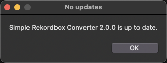
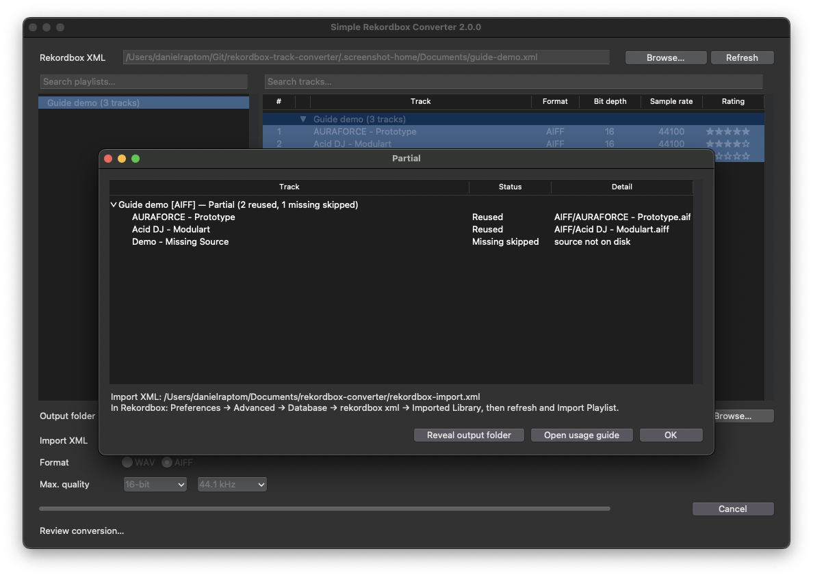
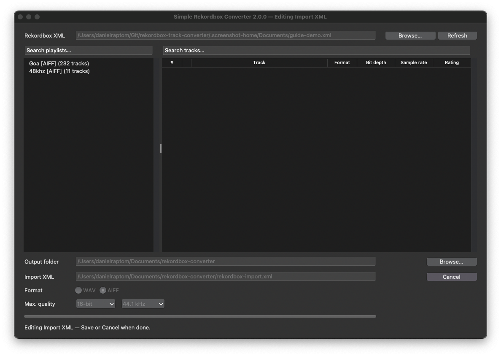

# How to use Simple Rekordbox Converter (macOS app v2.0.0)

Goal: new **WAV** or **AIFF** copies of a playlist, with cues, loops, beatgrid, rating, BPM, key, comments, colour, and tags, **without touching your originals**. The import playlist is named `{your playlist} [WAV]` or `{your playlist} [AIFF]`.

This guide is for the **packaged macOS app v2.0.0**. Menu names match **Rekordbox 7**; Rekordbox 6 is the same idea: export the collection, then use the **rekordbox xml** pane — never **File → Import**.

Screenshots below are from the **2.0.0** release candidate UI. Until GitHub publishes v2.0.0, build this tree with `./scripts/build-macos-app.sh` (see [README.md](README.md)) or wait for the release. Do not follow this guide against an older **v1.x** download.

---

## 1. Download, first launch, permissions, updates

1. Get **Simple Rekordbox Converter.app** (universal2) for **2.0.0** from [GitHub Releases](https://github.com/slnnzmtl/rekordbox-playlist-converter/releases) when published, or build this repository (README → Build the .app).
2. **First launch.** The app is ad-hoc signed. If Gatekeeper blocks it, right-click the `.app` → **Open**.
3. **Documents access.** macOS may ask for Documents access. If you decline, the app still opens and defaults to `~/rekordbox-converter` (Browse… can prompt again later). With Documents allowed, the default output folder is `~/Documents/rekordbox-converter`.
4. **Welcome.** On first launch, read the short guide and choose whether to share anonymous usage analytics (checkbox is **checked by default**). Continue, or open the full in-app guide.


5. **Updates.** On launch the GUI may contact GitHub Releases. You can also use Help → **Check for Updates…**. That network call is separate from analytics. See [SECURITY.md](SECURITY.md).



Privacy details: [README.md](README.md#privacy) and [SECURITY.md](SECURITY.md).

---

## 2. Export your collection from Rekordbox

This app does not open Rekordbox’s internal database. It only reads an XML export.

1. Wait until analysis has finished on the tracks you care about.
2. **Rekordbox 7:** Preferences → Advanced → rekordbox xml → enable **Export BeatGrid information**.
3. **File → Export Collection in xml format**.
4. Save locally (for example `Documents/rekordbox/rekordbox.xml`). Avoid iCloud or Dropbox for a large export if you can.

**Refresh:** after you change cues, grids, or playlists in Rekordbox, export again and click **Refresh** (or Browse…) in the app so it reloads the new XML.

---

## 3. Convert in the app


1. Choose the XML export (Browse… next to **Rekordbox XML**). The app remembers the last XML and output folder.
2. Select playlists in the folder tree and tracks in the tracklist.
3. Confirm the **output folder**. Import XML is always `<output folder>/rekordbox-import.xml`.
4. Choose **Format**: WAV or AIFF.
5. Choose **Maximum output quality** (16/24-bit and 44.1/48 kHz). These are ceilings, not targets. Defaults are 24-bit / 48 kHz. 16-bit tracks stay 16-bit; 44.1 kHz tracks stay 44.1 kHz.
6. Click **Convert**. Review the preview (input, format, action, reason, quality, size), then confirm.


**Conflicts** (destination changed outside this app) block Convert until you resolve them — the app does not overwrite those dests. Convert is also refused when disk space is insufficient or there is nothing to convert.

Preview **Action** / **Reason** (first write is **Convert** / Not converted yet):

| Action | Typical reason |
| --- | --- |
| Convert | Not converted yet |
| Recreate missing | Destination file is missing; or previous conversion did not finish |
| Reuse existing | Output is already current |
| Refresh XML | Rekordbox metadata changed |
| Update metadata | Rekordbox metadata changed (AIFF tags) |
| Rebuild container | Converter revision requires a container rebuild |
| Transcode | Source file changed; or output quality recipe changed; or Forced rebuild |
| In-place skip | Source and destination are the same file |
| Missing | Source file is missing |
| Conflict | Destination was changed outside this app |

**What you get**

- Audio in `<output folder>/WAV/` or `…/AIFF/` as `<artist> - <track>`
- Hidden `.rekordbox-converter-manifest.json` (**version 2**)
- Import file `<output folder>/rekordbox-import.xml`
- Playlist inside that file named `{your playlist} [WAV]` or `[AIFF]`

Originals stay where they are. Re-run with the same output folder to refresh or add tracks.

---

## 4. Progress, cancel, finish report, Reveal

While converting, **Cancel** stops in-flight encodes. Files already written stay on disk; Import XML is still written for successes.

When finished, the report title is **Done** / **Partial** / **Failed** / **Cancelled** / **No conversions**. Counts cover converted, copied, PCM-rebuilt, metadata-refreshed, reused, recreated, missing skipped, conflicts, state-changed, cancelled, and failed. **Reveal output folder** opens the chosen folder.



| Title | Meaning |
| --- | --- |
| Done | Every selected output succeeded |
| Partial | Some succeeded and some failed, conflicted, were cancelled, or were missing |
| Failed | Nothing succeeded and at least one item failed |
| Cancelled | The batch was cancelled |
| No conversions | Nothing succeeded and nothing failed (for example all missing) |

---

## 5. Bring it into Rekordbox

Do **not** use **File → Import**. Point Rekordbox at the **generated** Import XML, refresh, then copy the playlist into your library.

### Show the rekordbox xml pane (once)

1. **Preferences → View → Layout**.
2. Under **Media Browser**, check **rekordbox xml**.

### Point Rekordbox at this app’s XML

1. **Preferences → Advanced → Database**.
2. Under **rekordbox xml**, set **Imported Library** to `<output folder>/rekordbox-import.xml` — **not** your original collection export.
3. Close Preferences. You should see **rekordbox xml** in the browser tree.
4. If tracks do not show up, use the **refresh** control on the rekordbox xml library.

### Copy into your collection

1. Open **rekordbox xml** → **Playlists**.
2. Find `{your playlist} [WAV]` or `{your playlist} [AIFF]`.
3. Drag it onto **Playlists** in your main library, or right-click → **Import Playlist**.
4. Tracks only: **rekordbox xml → All Tracks**, select the audio rows, drag onto **Collection** (or right-click → **Import to Collection**).

If Rekordbox asks whether to load information from the library being imported, choose **Yes** so cues, loops, grid, BPM, key, comments, colour, and rating come across.

Play one track. Confirm it is on a disk Rekordbox can read.

### After import

- Analyze again only if waveforms are missing; cues and grid should already be there.
- **Do not move the output folder.** Rekordbox stores those paths.
- **New tracks later:** export XML again, convert with the same output folder, refresh **Imported Library**, then import the new rows.

---

## 6. Edit Import XML (safe removal)

When the output folder already contains `rekordbox-import.xml` and `.rekordbox-converter-manifest.json`, **Edit** appears beside the Import XML path. Edit mode browses that **generated** library; your Rekordbox source XML stays read-only.



- Right-click a playlist or track to remove it, or **Reveal in Finder** for a track file.
- Shift/Command-click to select several tracks, then right-click to remove them together.
- Tracks that remain in the collection after they leave every playlist appear under **Unknown**.
- Missing tracks show `!` in a status column (click the header to sort).
- Edits stay in a draft until **Save** (preview of pending removals: remove from playlist vs move to Trash) or **Cancel**.
- Convert and folder browsing are locked while editing.

---

## 7. Troubleshooting and recovery

| Symptom | What to do |
| --- | --- |
| Gatekeeper blocks the app | Right-click → **Open** (ad-hoc signed build). |
| Documents access denied | App still runs; default output is `~/rekordbox-converter`. Browse… can prompt again. |
| Convert disabled / blocked in preview | Resolve **conflicts**, free disk space, or fix **Missing** sources; then preview again. Conflicts are never overwritten. |
| Help → Check for Updates… | Contacts GitHub Releases; may say up to date vs the latest **published** tag. See [SECURITY.md](SECURITY.md). |
| Folder refused / “unmanaged” | Do **not** delete only `.rekordbox-converter-manifest.json`. Back up or recreate the **whole** output library, or choose a new empty folder. |
| Old development v1 library | Refused the same way — no migration to manifest v2. Copy audio you need, then recreate the folder. |
| Mid-batch crash | Manifest v2 keeps unfinished writes incomplete; the next run can recreate or finish. |

**Compatibility evidence** (Rekordbox 6.8.5 / 7.2.18 on macOS; empty cells = untested): [docs/rekordbox-xml-import-checklist.md](docs/rekordbox-xml-import-checklist.md).

**Privacy / network:** [README.md](README.md#privacy), [SECURITY.md](SECURITY.md).

Live import is **verified on macOS** with Rekordbox **6.8.5** and **7.2.18**. This tool does not open Rekordbox’s database or write USB export media. MP3, AAC, and other lossy files are skipped. Generated playlists are **flat**.

In the app, **Help → How to Use…** shows the same click-path without screenshots.

---

## 8. CLI / Terminal (optional)

Most people should use the macOS app above. The CLI is for automation or non-macOS hosts.

You need Python 3.10+ and `ffmpeg` (`ffprobe` included). On a Mac with Homebrew:

```bash
brew install ffmpeg
# if needed:
brew install python@3.12
```

```bash
./rb-converter.py
```

You will be asked for the XML, playlists, output folder (default `./output`), format, and quality ceilings. Import XML is always `<that folder>/rekordbox-import.xml` (CLI `--output` can override).

CLI `--dry-run` prints the same conversion plan the GUI preview shows. Preview actions, finish titles, cancel, and manifest v2 recovery match the app.

```bash
./rb-converter.py \
  --xml ~/Documents/rekordbox/rekordbox.xml \
  --playlist "Dark forest duplicate" \
  --format aiff \
  --bit-depth 24 \
  --sample-rate 48000
```

| Option | Default | Meaning |
| --- | --- | --- |
| `--xml` | asked | Collection export |
| `--playlist` | asked | Exact playlist name |
| `--format` | `wav` | `wav` or `aiff` |
| `--bit-depth` | `24` | Max `16` or `24` (no upconvert) |
| `--sample-rate` | `48000` | Max `44100` or `48000` (no upconvert) |
| `--wav-dir` | `./output` | Shared library (`WAV\|AIFF/<artist> - <track>`) |
| `--output` | `<wav-dir>/rekordbox-import.xml` | Optional override |
| `--force` | off | Rebuild files that already match the profile |
| `--dry-run` | off | Print the conversion plan; write nothing |
| `--analytics` | unset | `on` or `off`; persist consent (alone exits after saving) |
